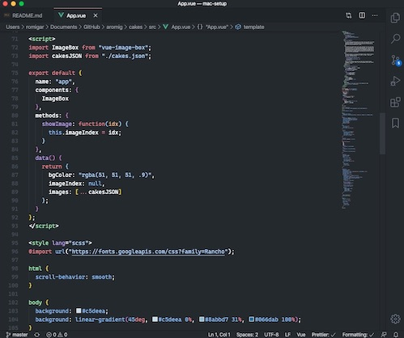

# MacBook Setup

Keeping track of how I have my MacBook configured because I can never remember everything I've installed or set up on it.

## Terminal


|     |                   |                                                                                                             |
| --- | ----------------- | ----------------------------------------------------------------------------------------------------------- |
| 🖥   | Terminal Software | [iTerm2](https://www.iterm2.com)                                                                            |
| ⌨️  | Shell             | [Oh My Zsh](https://ohmyz.sh)                                                                               |
| 🎩  | Oh My Zsh Theme   | [Avit (modified prompt for 🐧 emoji)](https://github.com/ohmyzsh/ohmyzsh/blob/master/themes/avit.zsh-theme) |
| 🎨  | Color Theme       | [Snazzy](https://github.com/sindresorhus/iterm2-snazzy)                                                     |
| 🖼   | Background        | Black with slight transparency                                                                              |
| 🔤  | Font              | [Cascadia Code](https://github.com/microsoft/cascadia-code), 14pt 110% Vertical Spacing                     |
| 📂  | List Files        | [Exa](https://github.com/ogham/exa) aliased to `ls`                                                         |
| 📝  | Shell Text Editor | pico                                                                                                        |



## Code Editor - [Visual Studio Code](https://code.visualstudio.com)

|     |             |                                                                                                    |
| --- | ----------- | -------------------------------------------------------------------------------------------------- |
| 🎨  | Color Theme | [GitHub Dark](https://marketplace.visualstudio.com/items?itemName=GitHub.github-vscode-theme)      |
| 🐧  | Icon Set    | [vscode-icons](https://marketplace.visualstudio.com/items?itemName=vscode-icons-team.vscode-icons) |
| 🔤  | Font        | [Cascadia Code](https://github.com/microsoft/cascadia-code), 14pt with ligatures enabled           |

### ⚙️ User Settings

```javascript
{
    "workbench.sideBar.location": "right",
    "workbench.colorTheme": "An old Hope with italics",
    "editor.fontSize": 14,
    "editor.fontLigatures": true,
    "window.clickThroughInactive": false,
    "editor.cursorBlinking": "smooth",
    "editor.cursorStyle": "line-thin",
    "editor.find.autoFindInSelection": true,
    "editor.formatOnPaste": true,
    "editor.multiCursorModifier": "ctrlCmd",
    "editor.fontFamily": "Cascadia Code, Menlo, Monaco, 'Courier New', monospace",
    "workbench.iconTheme": "vscode-icons",
    "workbench.editorAssociations": [
    ]
}
```

### 🔌 Extensions

- [Auto Close Tag](https://marketplace.visualstudio.com/items?itemName=formulahendry.auto-close-tag)
- [Auto Complete Tag](https://marketplace.visualstudio.com/items?itemName=formulahendry.auto-complete-tag)
- [Auto Rename Tag](https://marketplace.visualstudio.com/items?itemName=formulahendry.auto-rename-tag)
- [Bookmarks](https://marketplace.visualstudio.com/items?itemName=alefragnani.Bookmarks)
- [Bracket Pair Colorizer](https://marketplace.visualstudio.com/items?itemName=CoenraadS.bracket-pair-colorizer)
- [:emojisense:](https://marketplace.visualstudio.com/items?itemName=bierner.x2emojisense)
- [Formatting Toggle](https://marketplace.visualstudio.com/items?itemName=tombonnike.vscode-status-bar-format-toggle)
- [JavaScript (ES6) code snippets](https://marketplace.visualstudio.com/items?itemName=xabikos.JavaScriptSnippets)
- [npm Intellisense](https://marketplace.visualstudio.com/items?itemName=christian-kohler.npm-intellisense)
- [Prettier - Code Formatter](https://marketplace.visualstudio.com/items?itemName=esbenp.prettier-vscode)
- [Tailwind CSS IntelliSense](https://marketplace.visualstudio.com/items?itemName=bradlc.vscode-tailwindcss)
- [Vetur](https://marketplace.visualstudio.com/items?itemName=octref.vetur)
- [vscode-icons](https://marketplace.visualstudio.com/items?itemName=vscode-icons-team.vscode-icons)
- [Vue VSCode Snippets](https://marketplace.visualstudio.com/items?itemName=sdras.vue-vscode-snippets)
- [Vue Peek](https://marketplace.visualstudio.com/items?itemName=dariofuzinato.vue-peek)

## Other Apps

### Browsers

- 🦊 [Firefox](https://www.mozilla.org/en-US/firefox/new/)
- 🚘 [Chrome](https://www.google.com/chrome/)
- 🦁 [Safari](https://www.apple.com/safari/)

### Communication

- 💼 [Microsoft Teams](https://products.office.com/en-us/microsoft-teams/group-chat-software)
- 🗣 [Slack](https://www.google.com/url?sa=t&rct=j&q=&esrc=s&source=web&cd=3&cad=rja&uact=8&ved=2ahUKEwi9zcHQh8zcAhVFKqwKHd0VBJ4QjBAwAnoECAMQDQ&url=https%3A%2F%2Fslack.com%2Fdownloads%2Fosx&usg=AOvVaw3NrsHpKA1Xj4KjSR7e0Jpk)
- 💬 [Discord](https://discordapp.com)

### Utilities

- 📗 [Notion](https://notion.so) makes organizing tasks easy to visualize.
- 🖥 [Microsoft Remote Desktop](https://www.google.com/url?sa=t&rct=j&q=&esrc=s&source=web&cd=4&cad=rja&uact=8&ved=2ahUKEwjx2aSVgczcAhUMHqwKHZz-BDcQFjADegQIAxAB&url=https%3A%2F%2Frink.hockeyapp.net%2Fapps%2F5e0c144289a51fca2d3bfa39ce7f2b06%2F&usg=AOvVaw0uwTXKscOh-IrYbWsguK2t) for connecting to my Windows 10 desktop for things I cannot do in macOS.
- 🗄 [Azure Data Studio](https://github.com/microsoft/azuredatastudio) for MS SQL database operations such as browsing schema, stored procedures, functions, etc.
- 🗂 [FileZilla](https://filezilla-project.org) for FTP, of course.
- 🍺 [Homebrew](https://brew.sh/) for stuff. Plenty of stuff.
- 💾 [Mounty](http://enjoygineering.com/mounty/) to quickly mount/unmount NTFS partitions/drives in read/write mode.
- ☕️ [KeepingYouAwake](https://github.com/newmarcel/KeepingYouAwake) to prevent my Mac from going to sleep.
