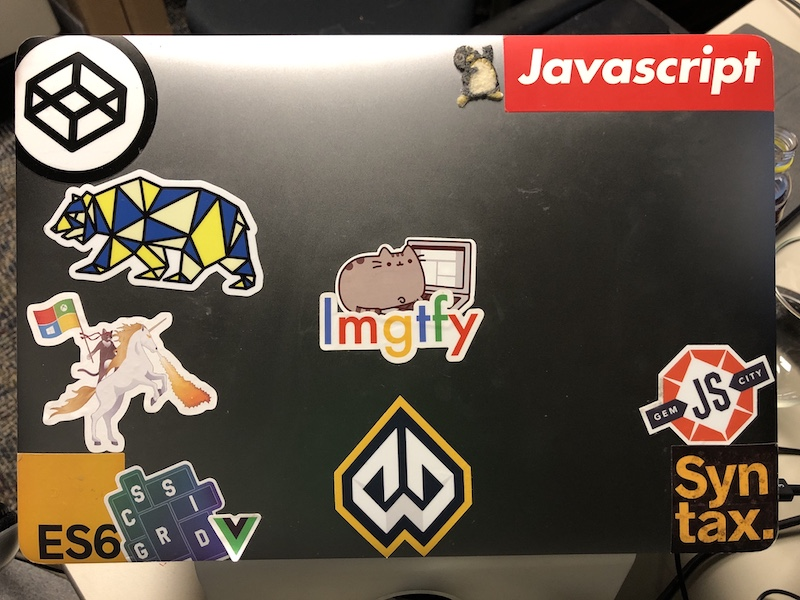

# MacBook Setup



Keeping track of how I have my MacBook configured because I can never remember everything I've installed or set up on it.

## Terminal


|    |                  |       |
|----|------------------|-------|
| 🖥 | Terminal Software| [iTerm2](https://www.iterm2.com) (Dark Theme)
| ⌨️ | Shell            | [fish shell](https://fishshell.com)
| 🎨 | Color Theme      | [Snazzy](https://github.com/sindresorhus/iterm2-snazzy)
| 🖼 | Background Image | [Image](./images/carbon_fiber_penguin.png)
| 🔤 | Font             | [Inconsolata](https://fonts.google.com/specimen/Inconsolata), 18pt, 110% Vertical Spacing
| ＞ | Prompt            | [my fish_prompt.fish](https://github.com/aromig/dotfiles/blob/master/fish/functions/fish_prompt.fish)
| 📂 | List Files       | [Exa](https://github.com/ogham/exa) with `alias ls=exa` in `~/.config/fish/config.fish`
| 📝 | Shell Text Editor| [µ micro](https://github.com/zyedidia/micro)

## Code Editor


[Visual Studio Code](https://code.visualstudio.com)

|    |                  |       |
|----|------------------|-------|
| 🎨 | Color Theme      | [Winter is Coming (Dark)](https://marketplace.visualstudio.com/items?itemName=johnpapa.winteriscoming)
| 🐧 | Icon Set         | [Roberto Huertas' VSCode Icons](https://marketplace.visualstudio.com/items?itemName=robertohuertasm.vscode-icons)
| 🔤 | Font             | [Fira Code](https://github.com/tonsky/FiraCode), 16pt with ligatures enabled

### ⚙️ User Settings

```javascript
{
    "window.clickThroughInactive": false,
    "editor.cursorBlinking": "smooth",
    "editor.cursorStyle": "line-thin",
    "editor.dragAndDrop": true,
    "editor.find.autoFindInSelection": true,
    "editor.fontFamily": "Fira Code, Inconsolata, Source Code Pro, monospace",
    "editor.fontLigatures": true,
    "editor.fontSize": 16,
    "editor.formatOnPaste": true,
    "editor.minimap.enabled": true,
    "editor.multiCursorModifier": "ctrlCmd",
    "editor.mouseWheelZoom": false,
    "editor.renderWhitespace": "none",
    "editor.snippetSuggestions": "top",
    "editor.wordWrap": "on",
    "files.associations": {
        "-.master": "html"
    },
    "gitlens.advanced.messages": {
        "suppressShowKeyBindingsNotice": true
    },
    "gitlens.currentLine.enabled": false,
    /* "mssql.connections": [], */
    "open-in-browser.default": "Firefox",
    "terminal.integrated.fontFamily": "Inconsolata",
    "terminal.integrated.fontSize": 16,
    "window.zoomLevel": 0,
    "workbench.colorTheme": "Winter is Coming (Dark)",
    "workbench.iconTheme": "vscode-icons",
}
```

### 🔌 Extensions

- [Auto Close Tag](https://marketplace.visualstudio.com/items?itemName=formulahendry.auto-close-tag)
- [Auto Rename Tag](https://marketplace.visualstudio.com/items?itemName=formulahendry.auto-rename-tag)
- [Bracket Pair Colorizer](https://marketplace.visualstudio.com/items?itemName=CoenraadS.bracket-pair-colorizer)
- [C# Extensions](https://marketplace.visualstudio.com/items?itemName=jchannon.csharpextensions)
- [C# Support](https://marketplace.visualstudio.com/items?itemName=ms-vscode.csharp)
- [Colorize](https://marketplace.visualstudio.com/items?itemName=kamikillerto.vscode-colorize)
- [ESLint](https://marketplace.visualstudio.com/items?itemName=dbaeumer.vscode-eslint)
- [Fish Shell IDE](https://marketplace.visualstudio.com/items?itemName=lunaryorn.fish-ide)
- [Fish Shell Support](https://marketplace.visualstudio.com/items?itemName=TeddyDD.fish)
- [GitLens](https://marketplace.visualstudio.com/items?itemName=eamodio.gitlens)
- [Go](https://marketplace.visualstudio.com/items?itemName=ms-vscode.Go)
- [Gutter Preview](https://marketplace.visualstudio.com/items?itemName=kisstkondoros.vscode-gutter-preview)
- [Indent Rainbow](https://marketplace.visualstudio.com/items?itemName=oderwat.indent-rainbow)
- [IntelliSense for CSS Class Names](https://marketplace.visualstudio.com/items?itemName=Zignd.html-css-class-completion)
- [IntelliSense for PHP](https://marketplace.visualstudio.com/items?itemName=felixfbecker.php-intellisense)
- [IntelliSense for SCSS](https://marketplace.visualstudio.com/items?itemName=mrmlnc.vscode-scss)
- [Markdown Linter](https://marketplace.visualstudio.com/items?itemName=DavidAnson.vscode-markdownlint)
- [Markdown Preview Enhanced](https://marketplace.visualstudio.com/items?itemName=shd101wyy.markdown-preview-enhanced)
- [MySQL Support](https://marketplace.visualstudio.com/items?itemName=formulahendry.vscode-mysql)
- [MySQL Syntax](https://marketplace.visualstudio.com/items?itemName=jakebathman.mysql-syntax)
- [MS SQL Support](https://marketplace.visualstudio.com/items?itemName=ms-mssql.mssql)
- [Open In Browser](https://marketplace.visualstudio.com/items?itemName=techer.open-in-browser)
- [PHP Tools for VSCode](https://marketplace.visualstudio.com/items?itemName=DEVSENSE.phptools-vscode)
- [PowerShell](https://marketplace.visualstudio.com/items?itemName=ms-vscode.PowerShell)
- [PrintCode](https://marketplace.visualstudio.com/items?itemName=nobuhito.printcode)
- [REST Client](https://marketplace.visualstudio.com/items?itemName=humao.rest-client)
- [SQL Beautify](https://marketplace.visualstudio.com/items?itemName=sensourceinc.vscode-sql-beautify)
- [SQL Tools](https://marketplace.visualstudio.com/items?itemName=mtxr.sqltools)
- [Sublime Babel](https://marketplace.visualstudio.com/items?itemName=joshpeng.sublime-babel-vscode)
- [Sublime Text Keymap & Settings](https://marketplace.visualstudio.com/items?itemName=ms-vscode.sublime-keybindings)
- [T-SQL Lint](https://marketplace.visualstudio.com/items?itemName=tsqllint.tsqllint)
- [WhiteViz](https://marketplace.visualstudio.com/items?itemName=spywhere.whiteviz)

## Other Apps

### Browsers

- 🦊 [Firefox](https://www.mozilla.org/en-US/firefox/new/)
- 🚘 [Chrome](https://www.google.com/chrome/)
- 🦁 [Safari](https://www.apple.com/safari/)
- ♬ [Opera](https://www.opera.com/)

### Communication

- 💬 [Skype for Business](https://www.microsoft.com/en-us/download/details.aspx?id=54108)
- 💼 [Microsoft Teams](https://products.office.com/en-us/microsoft-teams/group-chat-software)
- 🗣 [Slack](https://www.google.com/url?sa=t&rct=j&q=&esrc=s&source=web&cd=3&cad=rja&uact=8&ved=2ahUKEwi9zcHQh8zcAhVFKqwKHd0VBJ4QjBAwAnoECAMQDQ&url=https%3A%2F%2Fslack.com%2Fdownloads%2Fosx&usg=AOvVaw3NrsHpKA1Xj4KjSR7e0Jpk)

### Utilities

- 📗 [Evernote](https://www.evernote.com) combined with [Kabanote](https://www.kanbanote.com) makes organizing tasks easy to visualize.
- 🖥 [Microsoft Remote Desktop Beta](https://www.google.com/url?sa=t&rct=j&q=&esrc=s&source=web&cd=4&cad=rja&uact=8&ved=2ahUKEwjx2aSVgczcAhUMHqwKHZz-BDcQFjADegQIAxAB&url=https%3A%2F%2Frink.hockeyapp.net%2Fapps%2F5e0c144289a51fca2d3bfa39ce7f2b06%2F&usg=AOvVaw0uwTXKscOh-IrYbWsguK2t) for connecting to my Windows 10 desktop for things I cannot do in macOS.
- 🗄 [SQL Operations Studio](https://docs.microsoft.com/en-us/sql/sql-operations-studio/download?view=sql-server-2017) for MS SQL database operations such as browsing schema, stored procedures, functions, etc.
- 🗂 [FileZilla](https://filezilla-project.org) for FTP, of course.
- 🍺 [Homebrew](https://brew.sh/) for stuff. Plenty of stuff.
- 💾 [Mounty](http://enjoygineering.com/mounty/) to quickly mount/unmount NTFS partitions/drives in read/write mode.
- ☕️ [KeepingYouAwake](https://github.com/newmarcel/KeepingYouAwake) to prevent my Mac from going to sleep.